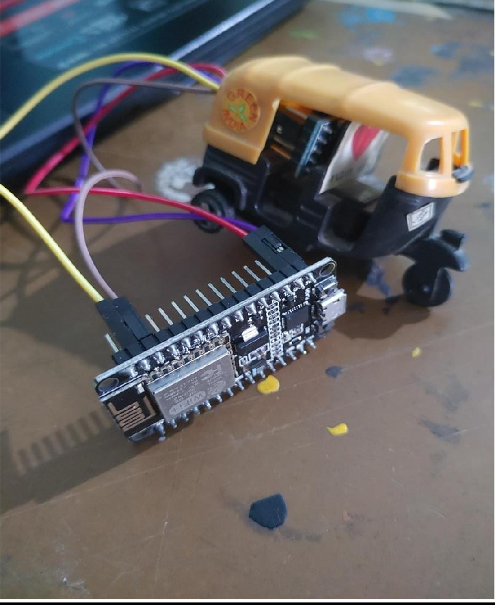

# Accident-Alert-System

Requirements:

• PC with Arduino

• Connecting Wires

• Breadboard
• Esp8266 module

• Wire Clipper

• USB Type A to Micro USB Cable

• DC 5V Power Supply

• DC 3.3V Power Supply

• AD XL 345 accelerometer

• Car Plastic Model

<b>Hardware:</b>

  
  
  

<b>App notification on screen:</b>

 
  
  

<b>Serial Monitor Readings:</b>

  

  

